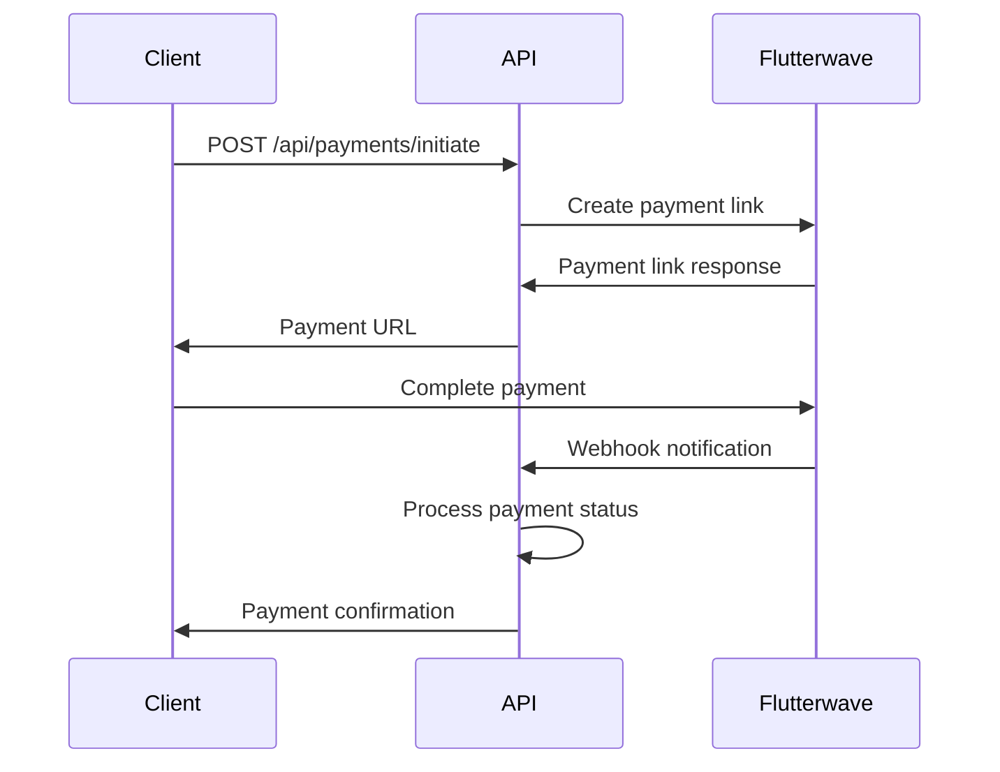

# Payment Integration Guide - Flutterwave

## Overview

MyTypist integrates with Flutterwave to provide seamless payment processing for Nigerian businesses. The integration supports multiple payment methods including cards, bank transfers, USSD, and mobile money.

## Setup and Configuration

### 1. Flutterwave Account Setup
1. Create a Flutterwave account at https://flutterwave.com
2. Complete business verification
3. Obtain API keys from the dashboard
4. Configure webhook URLs

### 2. Environment Configuration
```env
# Flutterwave API Keys
FLUTTERWAVE_PUBLIC_KEY=FLWPUBK_TEST-your-public-key
FLUTTERWAVE_SECRET_KEY=FLWSECK_TEST-your-secret-key
FLUTTERWAVE_WEBHOOK_SECRET=your-webhook-secret-hash

# Live keys for production
FLUTTERWAVE_PUBLIC_KEY=FLWPUBK-your-live-public-key
FLUTTERWAVE_SECRET_KEY=FLWSECK-your-live-secret-key
```

---

## Payment Flow

### 1. Payment Initiation
The payment process follows these steps:



### 2. Payment Initiation API
```http
POST /api/payments/initiate
Authorization: Bearer <access_token>
Content-Type: application/json

{
  "amount": 5000,
  "currency": "NGN",
  "payment_method": "card",
  "customer": {
    "email": "customer@example.com",
    "phone": "+2348012345678",
    "name": "John Doe"
  },
  "metadata": {
    "purpose": "document_generation",
    "documents_count": 5,
    "user_id": 123
  }
}
```

**Response:**
```json
{
  "payment_id": "pay_12345",
  "payment_url": "https://ravemodal-dev.herokuapp.com/v3/hosted/pay/abcd1234",
  "amount": 5000,
  "currency": "NGN",
  "status": "pending",
  "expires_at": "2025-01-15T11:30:00Z"
}
```

---

## Supported Payment Methods

### 1. Card Payments
- **Visa, MasterCard, Verve**
- **3D Secure authentication**
- **Instant confirmation**

```json
{
  "payment_method": "card",
  "card_details": {
    "number": "4187427415564246",
    "cvv": "828",
    "expiry_month": "09",
    "expiry_year": "32"
  }
}
```

### 2. Bank Transfer
- **All Nigerian banks supported**
- **Account number generation**
- **2-hour payment window**

```json
{
  "payment_method": "banktransfer",
  "bank_transfer": {
    "account_bank": "044",
    "account_number": "0690000031",
    "amount": 5000
  }
}
```

### 3. USSD Payments
- **All major networks**
- **Offline payment capability**
- **SMS confirmations**

```json
{
  "payment_method": "ussd",
  "ussd": {
    "account_bank": "058",
    "amount": 5000
  }
}
```

### 4. Mobile Money
- **MTN Mobile Money**
- **Airtel Money**
- **9mobile Pay**

```json
{
  "payment_method": "mobilemoney",
  "mobile_money": {
    "phone": "08012345678",
    "provider": "mtn"
  }
}
```

---

## Subscription Management

### 1. Plan Creation
```http
POST /api/payments/plans
Authorization: Bearer <admin_token>
Content-Type: application/json

{
  "name": "Pro Plan",
  "amount": 15000,
  "interval": "monthly",
  "description": "500 documents per month",
  "features": ["unlimited_templates", "priority_support", "api_access"]
}
```

### 2. Subscription Management
```http
# Subscribe user to plan
POST /api/payments/subscribe
Authorization: Bearer <access_token>
Content-Type: application/json

{
  "plan_id": "plan_12345",
  "customer": {
    "email": "user@example.com",
    "name": "John Doe"
  }
}

# Cancel subscription
POST /api/payments/subscriptions/{subscription_id}/cancel
Authorization: Bearer <access_token>

# Update subscription
PATCH /api/payments/subscriptions/{subscription_id}
Authorization: Bearer <access_token>
Content-Type: application/json

{
  "plan_id": "plan_67890"
}
```

---

## Webhook Integration

### 1. Webhook Endpoint
Flutterwave sends payment notifications to:
```
POST /api/payments/webhook
```

### 2. Webhook Security
All webhooks are verified using HMAC-SHA256:

```python
import hmac
import hashlib

def verify_webhook(payload: str, signature: str, secret: str) -> bool:
    """Verify Flutterwave webhook signature"""
    expected_signature = hmac.new(
        secret.encode('utf-8'),
        payload.encode('utf-8'),
        hashlib.sha256
    ).hexdigest()
    
    return hmac.compare_digest(signature, expected_signature)
```

### 3. Webhook Events
```json
{
  "event": "charge.completed",
  "data": {
    "id": 123456,
    "tx_ref": "TXN_12345",
    "flw_ref": "FLW_REF_12345",
    "status": "successful",
    "amount": 5000,
    "currency": "NGN",
    "customer": {
      "email": "customer@example.com",
      "name": "John Doe"
    },
    "meta": {
      "user_id": 123,
      "purpose": "document_generation"
    }
  }
}
```

---

## Error Handling

### 1. Payment Errors
```json
{
  "error": true,
  "error_code": "PAYMENT_FAILED",
  "message": "Card declined by issuer",
  "error_details": {
    "processor_response": "51",
    "processor_response_code": "DECLINED"
  }
}
```

### 2. Common Error Codes
- **INSUFFICIENT_FUNDS**: Customer has insufficient balance
- **INVALID_CARD**: Card details are incorrect
- **CARD_EXPIRED**: Card has expired
- **TRANSACTION_NOT_PERMITTED**: Bank declined transaction
- **NETWORK_ERROR**: Temporary network issue

---

## Testing

### 1. Test Cards
Flutterwave provides test cards for development:

```json
{
  "successful_card": {
    "number": "4187427415564246",
    "cvv": "828",
    "expiry_month": "09",
    "expiry_year": "32"
  },
  "insufficient_funds": {
    "number": "4187427415564248",
    "cvv": "828",
    "expiry_month": "09",
    "expiry_year": "32"
  }
}
```

### 2. Test Environment
```bash
# Test payment initiation
curl -X POST https://api.mytypist.com/api/payments/initiate \
  -H "Authorization: Bearer YOUR_TOKEN" \
  -H "Content-Type: application/json" \
  -d '{
    "amount": 1000,
    "currency": "NGN",
    "customer": {
      "email": "test@example.com",
      "name": "Test User"
    }
  }'
```

---

## Analytics and Reporting

### 1. Payment Analytics
```http
GET /api/payments/analytics?start_date=2025-01-01&end_date=2025-01-31
Authorization: Bearer <access_token>
```

**Response:**
```json
{
  "period": {
    "start_date": "2025-01-01",
    "end_date": "2025-01-31"
  },
  "summary": {
    "total_transactions": 1250,
    "successful_transactions": 1198,
    "failed_transactions": 52,
    "total_amount": 15750000,
    "success_rate": 95.84
  },
  "payment_methods": {
    "card": 856,
    "bank_transfer": 234,
    "ussd": 108,
    "mobile_money": 52
  },
  "daily_breakdown": [
    {
      "date": "2025-01-01",
      "transactions": 45,
      "amount": 567000,
      "success_rate": 97.8
    }
  ]
}
```

### 2. Revenue Tracking
```http
GET /api/payments/revenue?period=monthly&year=2025
Authorization: Bearer <admin_token>
```

---

## Integration Examples

### Frontend Integration (React)
```javascript
// Payment initiation
const initiatePayment = async (paymentData) => {
  try {
    const response = await fetch('/api/payments/initiate', {
      method: 'POST',
      headers: {
        'Authorization': `Bearer ${token}`,
        'Content-Type': 'application/json'
      },
      body: JSON.stringify(paymentData)
    });
    
    const data = await response.json();
    
    // Redirect to Flutterwave payment page
    window.location.href = data.payment_url;
  } catch (error) {
    console.error('Payment initiation failed:', error);
  }
};

// Payment verification
const verifyPayment = async (transactionId) => {
  const response = await fetch(`/api/payments/${transactionId}/verify`, {
    headers: {
      'Authorization': `Bearer ${token}`
    }
  });
  
  return response.json();
};
```

### Mobile Integration (React Native)
```javascript
import { Linking } from 'react-native';

const processPayment = async (paymentData) => {
  // Initiate payment
  const response = await initiatePayment(paymentData);
  
  // Open payment URL in browser
  await Linking.openURL(response.payment_url);
  
  // Listen for app return (implement deep linking)
  const url = await Linking.getInitialURL();
  if (url && url.includes('payment_status')) {
    await verifyPayment(extractTransactionId(url));
  }
};
```

---

## Best Practices

### 1. Security
- Always verify webhook signatures
- Use HTTPS for all payment communications
- Store sensitive data encrypted
- Implement proper error handling
- Log all payment activities

### 2. User Experience
- Provide clear payment instructions
- Show multiple payment options
- Implement payment status polling
- Handle payment failures gracefully
- Send payment confirmations

### 3. Performance
- Cache payment plans and configurations
- Use async processing for webhooks
- Implement payment retry logic
- Monitor payment processing times
- Optimize database queries

### 4. Compliance
- Store PCI-compliant payment data
- Implement proper audit trails
- Follow Nigerian payment regulations
- Maintain transaction records
- Implement dispute resolution

This comprehensive payment integration ensures secure, reliable, and user-friendly payment processing for Nigerian businesses using MyTypist.